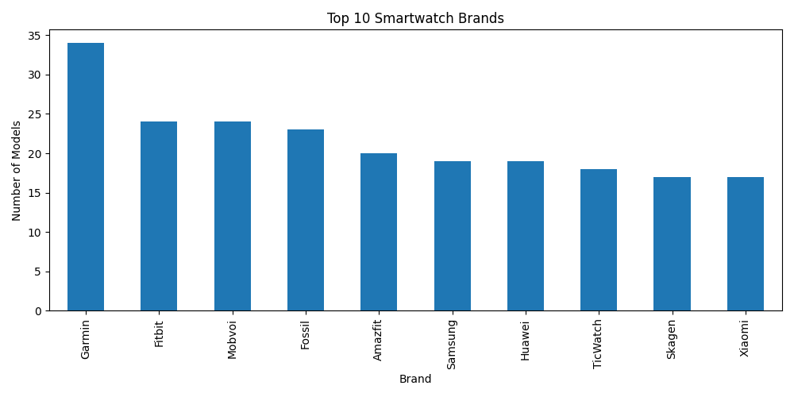
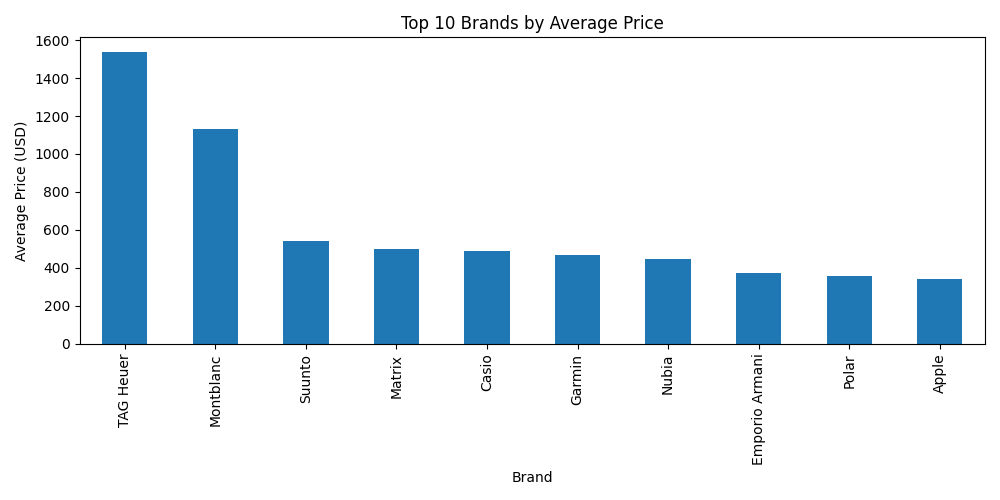
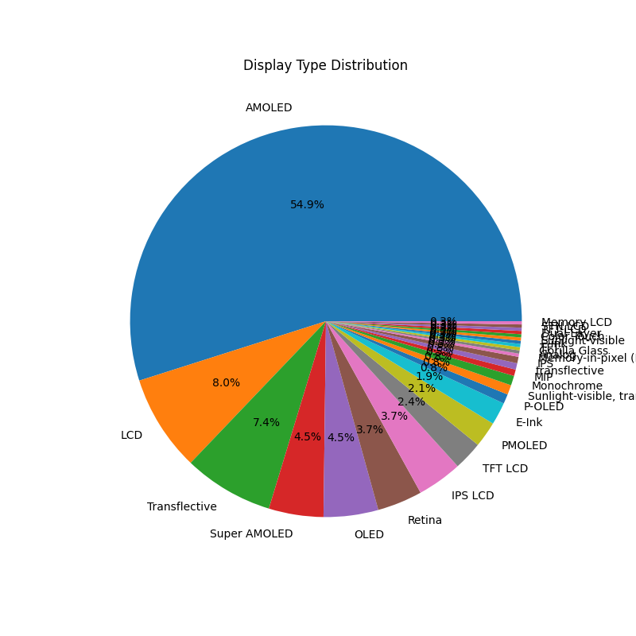
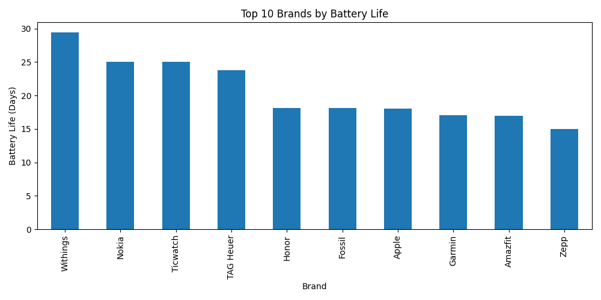
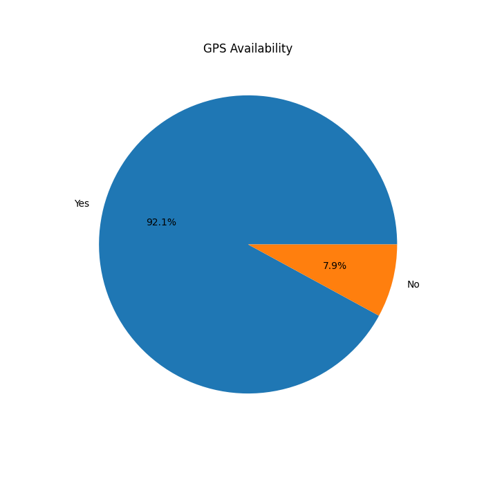
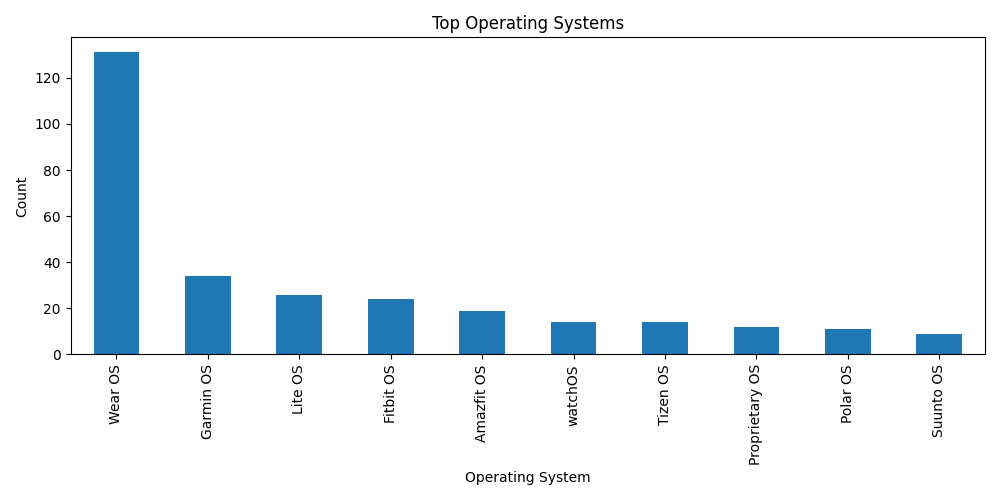

# smartwatch-market-analysis
# ⌚ Smartwatch Market Analysis

A Data Analytics project built using Python, Pandas, and Matplotlib to analyze smartwatch market trends, pricing, battery performance, operating systems, and display technologies.

## 📌 Project Overview

This project performs exploratory data analysis (EDA) on a smartwatch dataset containing 379 smartwatch models from multiple brands.

The analysis helps identify:

- Most expensive and cheapest smartwatches
- Top smartwatch brands in the market
- Average price by brand
- Battery life comparison across brands
- Display technology distribution
- GPS availability statistics
- Operating system popularity

---

## 🛠️ Technologies Used

- Python
- Pandas
- Matplotlib
- CSV Dataset

---

## 📊 Analysis Performed

### 1. Brand Analysis
- Top smartwatch brands by number of models

### 2. Price Analysis
- Most expensive smartwatch
- Cheapest smartwatch
- Top 10 brands by average price

### 3. Battery Analysis
- Top 10 brands by battery life

### 4. Display Type Analysis
- OLED vs AMOLED vs LCD distribution

### 5. GPS Analysis
- Percentage of smartwatches with GPS support

### 6. Operating System Analysis
- Most popular smartwatch operating systems

---

## 📈 Generated Charts

### Top Brands


### Average Price Analysis


### Display Type Distribution


### Battery Life Analysis


### GPS Availability


### Operating System Analysis


---

## 📂 Project Structure

```text
smartwatch-market-analysis
│
├── analysis.py
├── requirements.txt
├── README.md
│
├── dataset
│   └── smartwatch_dataset.csv
│
└── charts
    ├── top_brands.png
    ├── price_analysis.png
    ├── display_type_pie.png
    ├── battery_analysis.png
    ├── gps_analysis.png
    └── os_analysis.png
```

---

## ▶️ How to Run

Clone the repository:

```bash
git clone https://github.com/yourusername/smartwatch-market-analysis.git
```

Install dependencies:

```bash
pip install -r requirements.txt
```

Run the project:

```bash
python analysis.py
```

---

## 🎯 Key Insights

- TAG Heuer has the highest average smartwatch price.
- Garmin has the largest number of smartwatch models in the dataset.
- Several brands offer significantly longer battery life than premium brands.
- OLED and AMOLED displays dominate the smartwatch market.
- GPS functionality is available in the majority of smartwatch models.

---

## 👩‍💻 Author

**Thanisha S Kanchan**

MCA Student | Aspiring Data Analyst | Python Enthusiast

GitHub: https://github.com/thanisha2060
